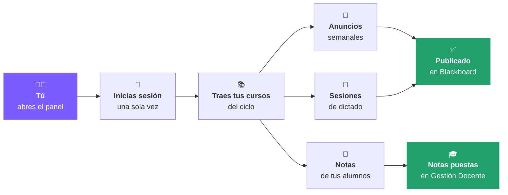
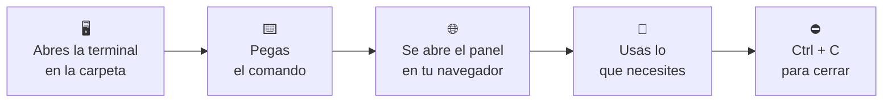
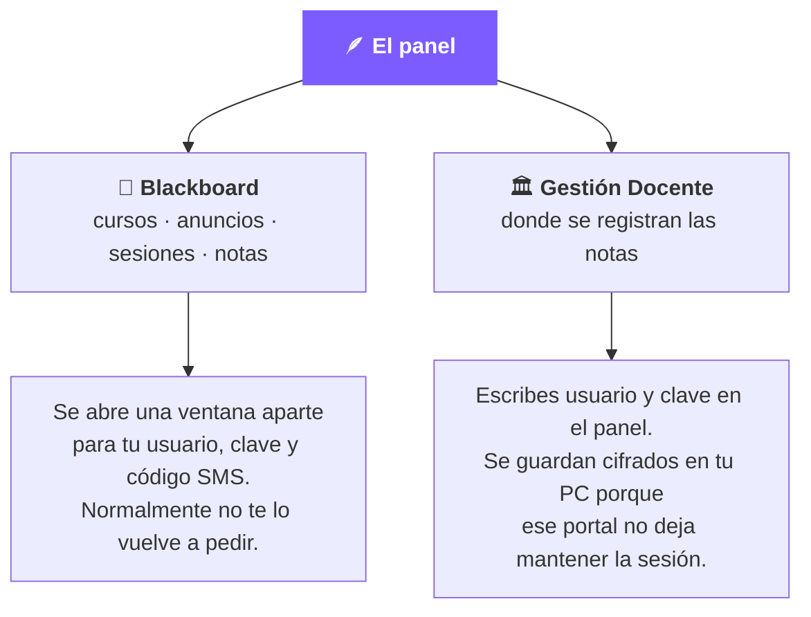
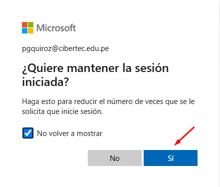

<h1 align="center">🪶 Willaq Yanapaq</h1>

<p align="center">
  <b>Haz en 2 minutos lo que hoy te toma toda una tarde.</b><br>
  Anuncios, sesiones de Collaborate y notas de Cibertec, en piloto automático.
</p>

<p align="center">
  🖥️ Funciona en tu propia computadora &nbsp;·&nbsp; 🔒 Con tu propio login &nbsp;·&nbsp; 🙅 Nadie comparte contraseñas
</p>

---

## 🎬 ¿Qué hace, en una imagen?



Tú revisas y confirmas en cada paso. **La herramienta nunca guarda una nota sin que tú lo veas antes.**

---

## 🧰 Las 5 herramientas del panel

|     | Herramienta | Para qué sirve |
| :-: | :---------- | :------------- |
| 📚 | **Obtener Cursos Activos** | Trae la lista de tus cursos del ciclo. Es el primer paso, todo lo demás se apoya en él. |
| 📢 | **Generar Anuncios Semanales** | Arma los anuncios de las semanas del curso y los publica en Blackboard. |
| 📅 | **Generar Sesiones Dictado** | Crea las sesiones de Collaborate según tu horario, saltándose los feriados. |
| 📝 | **Obtener Notas Blackboard y Otros** | Descarga las notas de un examen o actividad para todos tus alumnos de una vez. |
| 🎓 | **Procesar Notas Gestión Docente** | Cruza esas notas con la lista del portal y las escribe en la casilla que corresponde. |

---

## 🚀 Primera vez (solo una vez en la vida)

### 1️⃣ Ten Python instalado

Abre una terminal y escribe `python --version` *(en Mac usa `python3 --version`)*.

> 🟢 **Te responde con un número tipo 3.12** → listo, pasa al paso 2.
> 🔴 **Te dice que no reconoce el comando** → descárgalo de [python.org/downloads](https://www.python.org/downloads/).
> En Windows, **marca la casilla "Add Python to PATH"** durante la instalación. Es la más importante.

### 2️⃣ Instala la herramienta

Abre la terminal **dentro de la carpeta del proyecto** (la que contiene este archivo) y pega las líneas **una por una**:

<details open>
<summary><b>🪟 Windows</b></summary>

```
python -m venv .venv
.\.venv\Scripts\python -m pip install -r requirements.txt
.\.venv\Scripts\python -m playwright install chromium
```

</details>

<details>
<summary><b>🍎 Mac / 🐧 Linux</b></summary>

```
python3 -m venv .venv
.venv/bin/python -m pip install -r requirements.txt
.venv/bin/python -m playwright install chromium
```

</details>

⏳ La última línea descarga un navegador de unos 150 MB: puede demorar unos minutos. Cuando termine, aparecerá una carpeta nueva llamada `.venv` — esa es la señal de que todo salió bien.

**Y ya está.** No hay nada más que configurar: tu nombre y tu foto se detectan solos la primera vez que entras a Blackboard.

---

## ☀️ El día a día



**El comando de cada día:**

```
.\.venv\Scripts\python -m willaq.cli panel
```

*(en Mac / Linux: `.venv/bin/python -m willaq.cli panel`)*

💡 **Tip:** guárdalo en un archivo de notas o crea un acceso directo. Es siempre el mismo, todos los días.

---

## 🔑 Los dos accesos

El panel trabaja con dos sistemas de Cibertec y te muestra el semáforo de ambos arriba:



📌 **Cuando termines el código de verificación, Microsoft te va a preguntar esto:**

<p align="center">
  
</p>

Marca la casilla **"No volver a mostrar"** y haz clic en **"Sí"**, tal cual se ve en la imagen. Es lo que hace que la próxima vez no te vuelva a pedir el código.

🔐 **Sobre tu contraseña de Gestión Docente:** queda guardada en tu computadora, cifrada por Windows, en la carpeta `datos/` — que nunca se sube a ningún lado y solo tu usuario de Windows puede abrir. Si algún día cambias de contraseña, el panel te avisa y la reescribes ahí mismo. Con **"Olvidar credenciales"** la borras cuando quieras.

---

## 🩹 Si algo se rompe

<details>
<summary>🔴 <b>"El módulo '.venv' no pudo cargarse"</b> o <b>"CommandNotFoundException"</b></summary>

<br>Te faltó el `.\` del inicio. El comando empieza con `.\.venv\Scripts\python` — con punto y barra invertida, no con `.venv\...`.
</details>

<details>
<summary>🔴 <b>"ModuleNotFoundError: No module named 'playwright'"</b> (o 'flask', o 'openpyxl')</summary>

<br>Falta la instalación, o la estás corriendo con el Python equivocado. Repite la sección **Primera vez** completa y luego usa el comando del día a día tal cual está escrito.
</details>

<details>
<summary>🔴 <b>"python no se reconoce como un comando"</b></summary>

<br>Python no está instalado, o no marcaste "Add Python to PATH". Reinstálalo desde [python.org](https://www.python.org/downloads/) marcando esa casilla, cierra la terminal y vuelve a abrirla.
</details>

<details>
<summary>🔴 <b>No encuentra <code>.venv\Scripts\python</code></b></summary>

<br>Estás en otra carpeta. La terminal tiene que estar abierta **en la carpeta del proyecto**, la que contiene este archivo.
</details>

<details>
<summary>🔴 <b>"No se puede cargar el archivo Activate.ps1..."</b></summary>

<br>Solo sale si intentas "activar" el entorno, y no hace falta. Usa el comando del día a día que empieza con `.\.venv\Scripts\python`.
</details>

<details>
<summary>🔴 <b>La instalación falla con un error de certificado</b></summary>

<br>Típico en laptops de empresa con antivirus corporativo (Zscaler, Netskope y parecidos). Pide ayuda al soporte técnico de tu institución o a quien te compartió la herramienta.
</details>

<details>
<summary>🟡 <b>Me vuelve a pedir el login</b></summary>

<br>Es normal cada cierto tiempo: la sesión de Blackboard expira. Complétalo otra vez como la primera vez y sigue.
</details>

---

<p align="center">
  🔒 <b>Tu contraseña y tu sesión no salen de tu computadora.</b><br>
  Viven en la carpeta <code>datos/</code>. No la subas ni la compartas con nadie.
</p>
